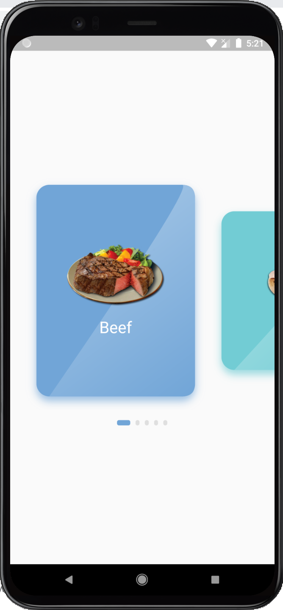
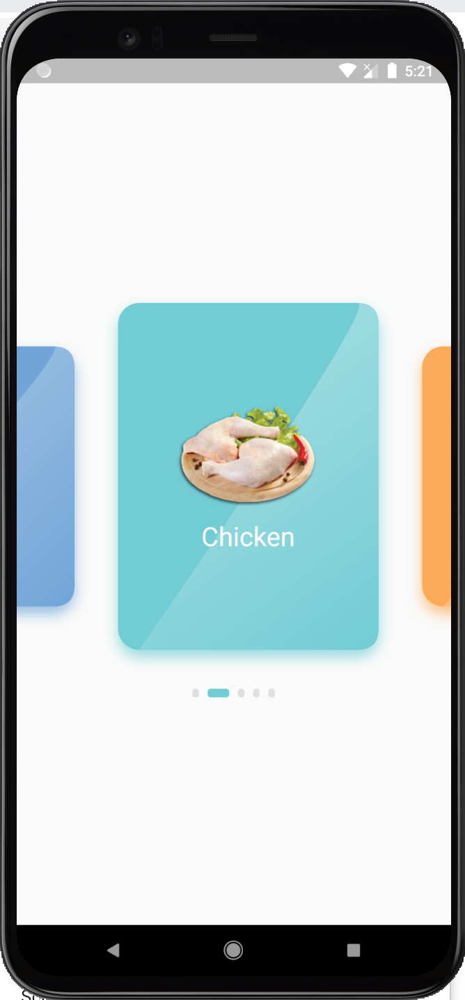
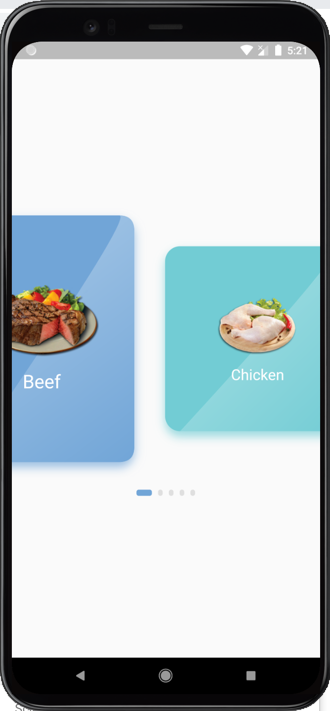

<p align="center">
	<a href="https://github.com/hosain-mohamed"></a>
	<a href="https://github.com/hosain-mohamed"></a>
	<a href="https://github.com/tenhobi/effective_dart"></a>
	<a href="https://opensource.org/licenses/MIT"></a>
</p>

# Scaled List
A Horizontal List view With Lots of modification including a scaled current item.
- Provided with curved custom painting and Dots indictor below it.
- it makes the widget of item builder responsive to the device screen's width and height.
- You can also set the  relative width , margin width , height of selected and unselected Card to the entire screen

<p align="center">
	
	
	
	
</p>

## Usage

```dart
  @override
  Widget build(BuildContext context) {
    return Scaffold(
      body: ScaledList(
        itemCount: Data.categories.length,
        itemColor: (index) {
          return kMixedColors[index % kMixedColors.length];
        },
        itemBuilder: (index, selectedIndex) {
          final category = Data.categories[index];
          return Column(
            mainAxisAlignment: MainAxisAlignment.center,
            children: [
              Container(
                height: selectedIndex == index
                    ? 100
                    : 80,
                child: Image.asset(category.image),
              ),
              SizedBox(height: 15),
              Text(
                category.name,
                style: TextStyle(
                    color: Colors.white,
                    fontSize: selectedIndex == index
                        ? 25
                        : 20),
              )
            ],
          );
        },
      ),
    );
  }
  ```
  
## Usage Scenarios
- When You like to add items in scaled manner and add custom curved painting over each item ;

## Contributers
<a href="https://github.com/MuhammadAlsaied"> Muhammad Alsaied</a>
<a href="https://github.com/hosain-mohamed"> Hosain Mohamed</a>
